# Why Code Works Locally But Fails on Vercel/Railway

## Overview

This document explains the fundamental differences between local development and production deployments that cause import/module resolution issues.

## Visual Comparison

```mermaid
graph TB
    subgraph Local["🏠 Local Development"]
        LClient["client/src/"]
        LServer["server/src/"]
        LShared["shared/"]
        LClient -->|"Vite alias: @shared"| LShared
        LServer -->|"build.js copies"| LServerShared["server/src/shared/"]
        LShared -->|"source"| LServerShared
    end
    
    subgraph Vercel["☁️ Vercel (Serverless)"]
        VClient["client/dist/"]
        VAPI["api/game/start.ts"]
        VAPIShared["api/shared/"]
        VAPI -->|"imports from"| VAPIShared
        VAPI -.->|"❌ Can't access"| VRootShared["shared/ (repo root)"]
    end
    
    subgraph Railway["🚂 Railway (Full Server)"]
        RServer["server/src/"]
        RBuild["build.js"]
        RShared["shared/"]
        RServerShared["server/src/shared/"]
        RBuild -->|"copies during prebuild"| RServerShared
        RShared -->|"source"| RServerShared
        RServer -->|"imports from"| RServerShared
    end
```



## Architecture Comparison

### Local Development Environment

```
flip7-webapp/
├── client/              # Vite dev server (port 3001)
│   ├── src/
│   └── vite.config.ts   # Has alias: @shared → ../shared
├── server/              # Express server (port 5001)
│   ├── src/
│   │   └── shared/      # Copied by build.js during prebuild
│   └── build.js         # Copies ../shared → src/shared
├── api/                 # NOT USED locally
└── shared/              # Source of truth
    ├── types/
    └── utils/
```

**How it works locally:**
1. **Client**: Vite dev server uses `vite.config.ts` alias to resolve `@shared` → `../shared`
2. **Server**: `build.js` runs during `prebuild` and copies `shared/` → `server/src/shared/`
3. **Full file system**: Node.js can resolve any relative path (`../../shared/`)
4. **TypeScript**: Compiles with full project context, can resolve paths from `tsconfig.json`

### Vercel Deployment (Serverless Functions)

```
Vercel Deployment:
├── client/dist/         # Built static files
└── api/                 # Serverless functions (isolated)
    └── game/
        ├── start.ts     # Tries to import from ../../shared/
        └── shared/      # ✅ NOW EXISTS (we copied it)
```

**Why it was failing:**
1. **Isolated functions**: Each serverless function runs in its own isolated environment
2. **No build step**: Vercel doesn't run a build script for `api/` directory
3. **Module resolution**: Can't resolve `../../shared/` because:
   - Functions only have access to files in their directory tree
   - `shared/` at repo root isn't included in function bundle
   - No build process to copy files
4. **TypeScript compilation**: Happens at runtime, needs files to exist

**The fix:**
- Copied `shared/` → `api/shared/` manually
- Updated imports to use `../shared/` instead of `../../shared/`

### Railway Deployment (Full Server)

```
Railway Deployment:
├── server/
│   ├── src/
│   │   └── shared/      # ✅ Copied by build.js during prebuild
│   ├── dist/            # Compiled JavaScript
│   │   └── shared/      # ✅ Copied during build
│   └── build.js         # Runs: npm run prebuild → copies shared/
```

**Why it works:**
1. **Build process**: Railway runs `npm run prebuild` which executes `build.js`
2. **File copying**: `build.js` copies `../shared/` → `src/shared/`
3. **Full server**: Has access to entire file system
4. **Compilation**: TypeScript compiles with `src/shared/` in place

## Key Differences

### 1. File System Access

| Environment | File System | Can Access `../../shared/`? |
|------------|-------------|----------------------------|
| **Local Dev** | Full access | ✅ Yes - all files present |
| **Vercel Functions** | Isolated | ❌ No - only `api/` directory |
| **Railway** | Full access | ✅ Yes - after build copies files |

### 2. Build Process

| Environment | Build Step | Shared Files |
|------------|------------|--------------|
| **Local Dev** | Manual/Dev server | ✅ Available via aliases |
| **Vercel Functions** | None for `api/` | ❌ Not included (until we copied) |
| **Railway** | `npm run prebuild` | ✅ Copied by `build.js` |

### 3. Module Resolution

| Environment | Resolution Method | Works? |
|------------|------------------|--------|
| **Local Dev** | TypeScript paths + Vite aliases | ✅ Yes |
| **Vercel Functions** | Node.js ESM resolution | ❌ No (files missing) |
| **Railway** | TypeScript compilation | ✅ Yes (after copy) |

### 4. Import Paths

**Client (works everywhere):**
```typescript
// Uses Vite alias configured in vite.config.ts
import { something } from '@shared/utils/gameLogic'
// Resolves to: ../shared/utils/gameLogic.ts
```

**Server (works on Railway, not Vercel):**
```typescript
// Railway: build.js copies shared → src/shared
import { something } from '../shared/utils/gameLogic.js'
// ✅ Works after build

// Vercel API: No build step, files don't exist
import { something } from '../../shared/utils/gameLogic.js'
// ❌ Fails - ../../shared/ doesn't exist in function bundle
```

## The Problems

### Problem 1: Vercel Serverless Functions

**Issue**: Vercel serverless functions are isolated and don't have access to files outside the `api/` directory.

**Why it fails:**
- Functions run in isolated containers
- Only files in `api/` directory are bundled
- No build step to copy `shared/` into `api/`
- Relative paths like `../../shared/` can't resolve outside function directory

**Solution Applied:**
- Manually copied `shared/` → `api/shared/`
- Updated imports to use `../shared/` (local to api directory)

### Problem 2: Railway Build Process

**Issue**: Railway needs the build process to copy shared files.

**Why it works:**
- Railway runs `npm run prebuild` → executes `build.js`
- `build.js` copies `../shared/` → `server/src/shared/`
- TypeScript compiles with `src/shared/` in place
- Runtime has access to compiled files in `dist/shared/`

**Potential Issue:**
- If `build.js` fails, shared files won't be copied
- Import paths must match: `../shared/` (not `../../shared/`)

## Solutions Summary

### ✅ Vercel Fix
1. Copy `shared/` directory into `api/shared/`
2. Update imports in `api/game/*.ts` to use `../shared/`
3. Ensure all shared files are JavaScript (not TypeScript) for runtime

### ✅ Railway Fix
1. Ensure `build.js` runs during `prebuild`
2. Verify shared files are copied to `server/src/shared/`
3. Update imports to use `../shared/` (matching copied location)

## Best Practices Going Forward

1. **For Vercel API Routes:**
   - Keep shared code in `api/shared/` directory
   - Use relative imports: `../shared/`
   - Don't rely on files outside `api/` directory

2. **For Railway Server:**
   - Keep `build.js` script to copy shared files
   - Ensure `prebuild` runs before `build`
   - Use relative imports matching copied location

3. **For Client:**
   - Use Vite aliases (already working)
   - TypeScript paths in `tsconfig.json` handle resolution

## Current Status

- ✅ **Client**: Works everywhere (uses Vite aliases)
- ✅ **Railway**: Works (build.js copies shared files)
- ⚠️ **Vercel API**: Fixed (shared files copied to api/shared/)
- ⚠️ **Vercel API**: Still debugging 500 error (likely runtime issue)

